# 00 — Project Brief

> **Document purpose:** Capture the *why* behind GeoUMKM Smart — the problem we solve,
> the vision, the target users, what we build first, and how we measure success.

**Version:** 4.0  
**Last Updated:** 2026-06-02  
**Status:** Production Documentation

---

## 1. Summary

**GeoUMKM Smart v4.0** adalah sistem **intelijen lokasi dan penilaian risiko kredit berbasis AI
dan geospatial analytics** yang melayani tiga target pengguna utama Indonesia:

- **🏦 Bank** — Credit risk scoring dengan Probability of Default (PD) buckets untuk portofolio UMKM
- **🏛️ Pemerintah** — Identifikasi kecamatan prioritas dan simulasi dampak kebijakan (KUR, pelatihan, infrastruktur)
- **💼 Investor** — Location scoring dan rekomendasi peluang investasi per sektor & wilayah

Setiap pengguna mendapat **dashboard analytics, model predictions, dan rekomendasi actionable** dari
pipeline ML yang aman dan transparan.

---

## 2. Problem Statement

Indonesia memiliki **61.5 juta UMKM** yang menjadi tulang punggung ekonomi, namun:

1. **Bank kesulitan assess kredit** — Data UMKM tidak terstruktur, riwayat kredit terbatas, collateral
   informal → PD modeling sulit, risiko tinggi, kredit terbatas.

2. **Pemerintah buta dengan targeting** — Program KUR, pelatihan, infrastruktur tersebar; sulit tahu
   **mana wilayah paling prioritas**, sektor apa yang struggling, dampak kebijakan seperti apa.

3. **Investor tidak tahu lokasi terbaik** — Ribuan sub-district di Indonesia; tidak ada skor
   **oportunitas investasi per lokasi** yang kredibel, berbasis data.

**GeoUMKM Smart** mengatasi ketiga pain ini dengan **satu platform** yang mengubah data UMKM
(lokasi, sektor, finansial proxy) menjadi **credit scores, policy simulations, dan investment recommendations**.

---

## 3. Vision

> *A data-driven system that makes UMKM credit more accessible, government more informed,
> and investors more confident — powered by transparent, explainable AI.*

---

## 4. Goals and Non-Goals

### 4.1 Goals (v3.0)

- **Complete ML pipeline** — 8 notebooks yang generate 4 core models secara berurutan
- **Bank-ready credit scoring** — PD buckets, calibration, regulatory compliance (basel-ready)
- **Government analytics** — Priority clustering, what-if simulation, policy impact estimation
- **Investor intelligence** — Location scoring, opportunity ranking, sector insights
- **Transparent & auditable** — SHAP explainability, model cards, decision logs
- **Production API** — REST endpoints untuk credit scores, recommendations, model inference
- **Deployment-ready** — Azure, Docker, CI/CD pipeline

### 4.2 Non-Goals (v3.0)

- Real-time streaming predictions (batch-ready, v3.1+)
- Mobile app (web dashboard only, v3.1+)
- Fine-tuning LLM (RAG + prompt-engineering only)
- Multi-currency support (IDR primary)
- Plugin marketplace (core only)

---

## 5. Target Users (Personas)

| Persona | Role | Institution | Key needs | Success metric |
|---------|------|-------------|-----------|-----------------|
| **Budi** | Credit Risk Manager | Bank | Score UMKM portfolio, identify PD bands, reduce losses | Score portfolio; PD < 5% error |
| **Siti** | Policy Analyst | Government (Dinas) | Find kecamatan to prioritize; estimate policy impact | Run 10+ simulations/month |
| **Ravi** | Investment Scout | Private equity | Find high-growth UMKM clusters; location recommendations | Invest in 3+ new kecamatan |
| **Ani** | Data Scientist | Regulator | Audit models, validate scores, compliance check | Full traceability + SHAP |
| **Dedi** | System Admin | Operator | Deploy, monitor, update models quarterly | 99.5% uptime |

---

## 6. Value Proposition

- **For banks:** Faster, more accurate credit decisions; lower portfolio risk; regulatory compliance.
- **For government:** Data-driven policy targeting; measure intervention impact; budget allocation confidence.
- **For investors:** Identify high-opportunity UMKM clusters; reduce investment risk; geographic diversification.
- **For society:** More UMKM get credit; smarter government intervention; economic growth.

---

## 7. Scope Overview (v3.0 Pillars)

```mermaid
flowchart LR
  subgraph DATA["Data Pipeline"]
    D1["10k UMKM dataset"]
    D2["596 kecamatan features"]
    D3["34 engineered features"]
  end
  
  subgraph ML["ML Models"]
    M1["Location Scoring<br/>(XGBoost)"]
    M2["Credit Risk Model<br/>(XGBoost + PD)"]
    M3["Clustering<br/>(K-Means + DBSCAN)"]
    M4["Recommendations<br/>(Multi-criteria)"]
  end
  
  subgraph APP["Application"]
    A1["API (REST)"]
    A2["Dashboard (React)"]
    A3["Audit Logs"]
  end
  
  subgraph EVAL["Evaluation"]
    E1["Model Cards"]
    E2["SHAP Explainability"]
    E3["Backtesting"]
  end
  
  DATA --> ML --> APP --> EVAL
```

---

## 8. Success Metrics (KPIs)

| Category | Metric | v3.0 Target | How measured |
|----------|--------|-------------|--------------|
| **Model accuracy** | PD buckets prediction error | < 5% | Backtesting on hold-out UMKM data |
| **Adoption** | Bank users running credit scores/month | ≥ 100 | API usage logs |
| **Impact** | Government simulations run/month | ≥ 50 | Platform analytics |
| **Reliability** | API uptime | ≥ 99.5% | Azure monitoring |
| **Transparency** | Model explainability coverage | 100% | SHAP on all predictions |
| **Regulatory** | PD calibration accuracy | ± 2% | Calibration curve validation |

---

## 9. Constraints & Assumptions

- **Data:** 10,000 synthetic UMKM dataset representing Jawa Barat's real demographic + sector distribution
- **Deployment:** Azure Static Web Apps (frontend) + Azure Functions (API)
- **Privacy:** No real customer data in v3.0 (synthetic); compliance config ready for v3.1
- **Providers:** Models run locally; no external AI providers needed (vs. AIU CMS)
- **Governance:** Indonesian regulatory framework (BI, OJK-ready)

---

## 10. High-Level Risks

| ID | Risk | Likelihood | Impact | Mitigation |
|----|------|-----------|--------|------------|
| R1 | Model drift (scores change over time) | Medium | High | Quarterly retraining; monitoring thresholds |
| R2 | Data quality issues (garbage features) | Medium | High | EDA validation; feature engineering checks |
| R3 | Overfitting (model works on train, fails on real UMKM) | Medium | High | Hold-out validation; cross-validation; backtesting |
| R4 | API latency too high for real-time | Low | Medium | Async batch API; caching; model quantization |
| R5 | Explainability insufficient for regulators | Medium | Medium | SHAP + model cards; audit trail |

---

## 11. Glossary

| Term | Definition |
|------|-----------|
| **UMKM** | Usaha Mikro Kecil Menengah (Indonesian MSMEs) |
| **PD** | Probability of Default (likelihood loan won't repay) |
| **Score band** | Credit score buckets (e.g., A=0-50, B=50-100, C=100-150) |
| **Location scoring** | Model predicting UMKM success/opportunity potential per kecamatan |
| **Clustering** | Segmentation of kecamatan into similar groups (K-Means + DBSCAN) |
| **What-If simulation** | Model estimating impact of policy change on UMKM scores |
| **Recommendation engine** | System ranking kecamatan by investment/intervention priority |
| **Explainability (SHAP)** | Feature importance + prediction breakdown for transparency |
| **Model card** | Documentation of model: purpose, performance, limitations, caveats |

---

## 12. Timeline & Phases

- **v4.3** — Complete 8-notebook pipeline; 4 core models; REST API; basic dashboard
- **v4.2** — Real-time scoring; multi-region expansion; RAG knowledge base
- **v4.1** — Mobile app; advanced simulations; provider integrations

---

## Changelog

- **v1.0** — Initial project brief for GeoUMKM Smart v4.0
