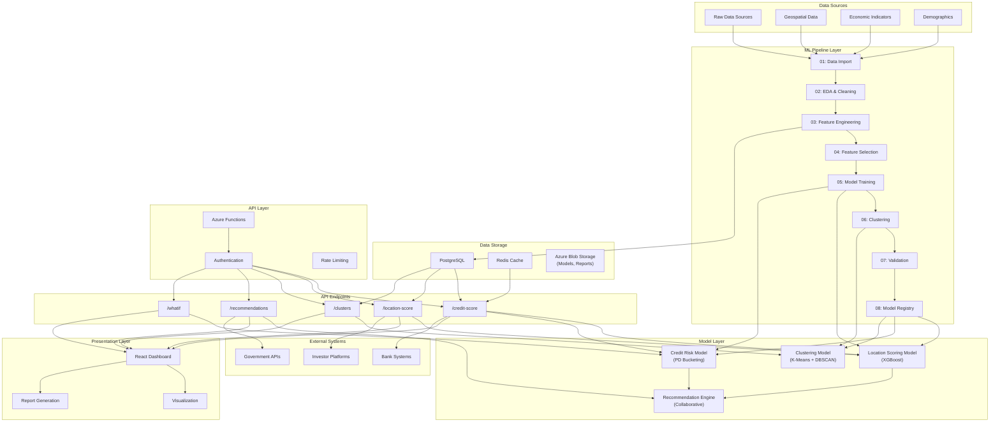
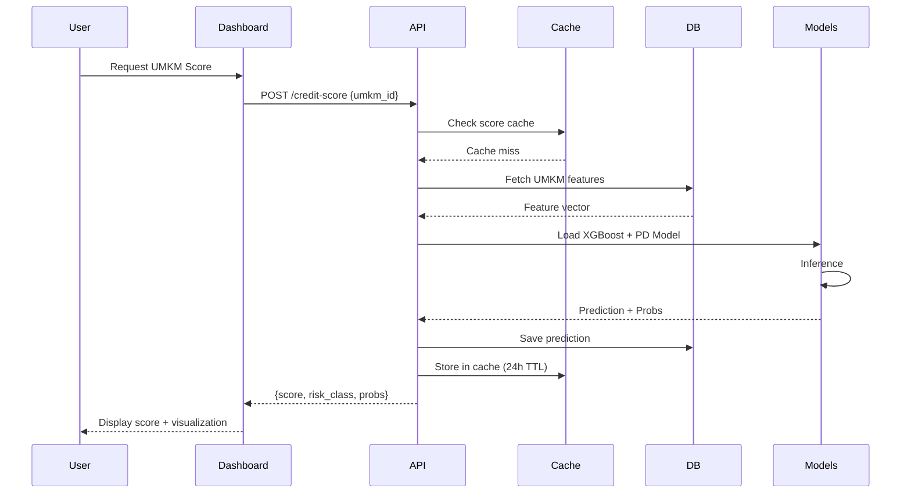
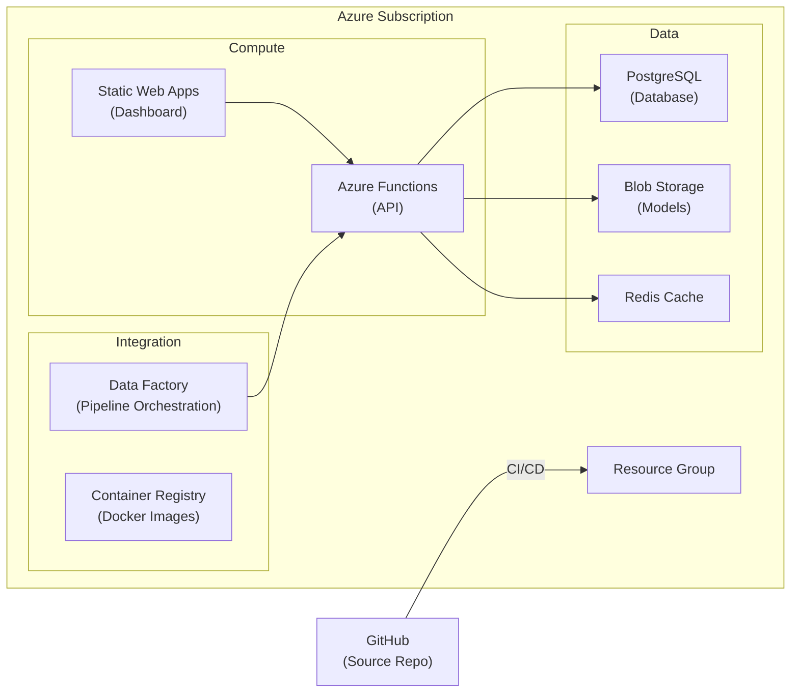
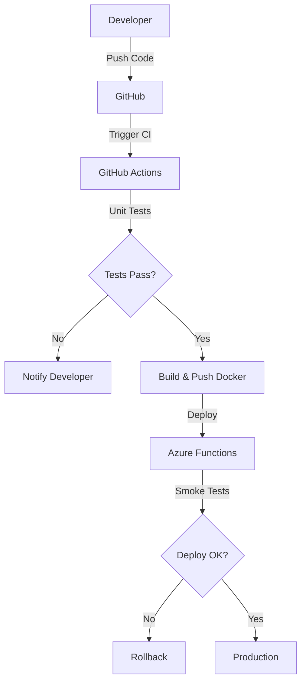

# GeoUMKM Smart - System Architecture

**Version:** 4.0
**Last Updated:** 2026
**Status:** Production Documentation

## Purpose

This document describes the complete architecture of GeoUMKM Smart (Geo-based Unsecured Micro-Credit Scoring Machine Learning), an AI-powered credit risk and opportunity scoring system designed for Indonesian MSMEs (Micro, Small, and Medium Enterprises). The system processes geospatial and economic data through machine learning pipelines to deliver credit risk scores, location opportunities, and personalized recommendations.

---

## Executive Overview

GeoUMKM Smart is a distributed system serving three primary user personas:
- **Banks**: Credit risk assessment and decision support
- **Government**: Policy-making and MSME development insights
- **Investors**: Opportunity identification and portfolio analysis

The system integrates:
- **Data Pipeline**: Python ML notebooks processing raw data
- **ML Models**: Location scoring, credit risk (XGBoost), clustering, recommendations
- **REST API**: Azure Functions serving real-time predictions
- **Dashboard**: React web interface for visualization and analysis

---

## System Architecture Diagram



---

## Component Architecture

### 1. **Data Layer**

#### Responsibility
- Store raw and processed UMKM data
- Maintain feature datasets
- Track audit and versioning

#### Components
```
Data Layer
├── PostgreSQL Database
│   ├── UMKM Entity Data
│   ├── Kecamatan Features
│   ├── Prediction Results
│   └── Audit Logs
├── Azure Blob Storage
│   ├── Model Artifacts
│   ├── Feature Datasets
│   ├── Validation Reports
│   └── Training Logs
└── Redis Cache
    ├── Frequently Accessed Features
    ├── Score Cache (TTL: 24h)
    └── User Session Data
```

#### Key Tables
- `umkm` - Core UMKM business data
- `kecamatan` - Administrative region features
- `features` - Engineered features per UMKM
- `model_predictions` - Score outputs
- `audit_logs` - Compliance and tracking

---

### 2. **ML Pipeline Layer**

#### Responsibility
- Transform raw data into model-ready features
- Train and validate machine learning models
- Generate artifacts and reports

#### Execution Sequence
```
01-data-import
    ↓
02-eda-and-cleaning
    ↓
03-feature-engineering (34 features)
    ↓
04-feature-selection
    ↓
05-model-training
    ├→ Location Scoring (XGBoost)
    ├→ Credit Risk (PD Bucketing)
    └→ Base Clustering Model
    ↓
06-clustering
    └→ K-Means + DBSCAN Ensemble
    ↓
07-validation
    └→ Backtesting & Stress Testing
    ↓
08-model-registry
    └→ Push to Production
```

#### Key Notebooks
| Notebook | Purpose | Input | Output |
|----------|---------|-------|--------|
| 01-data-import | Load raw data from sources | CSV, APIs, Databases | Cleaned datasets |
| 02-eda-and-cleaning | Exploratory analysis and data quality | Raw datasets | Quality report |
| 03-feature-engineering | Create 34 engineered features | Clean datasets | Feature matrix |
| 04-feature-selection | Reduce dimensionality | Feature matrix | Selected features |
| 05-model-training | Train XGBoost and PD models | Selected features | Trained models |
| 06-clustering | K-Means + DBSCAN segmentation | Feature matrix | Cluster assignments |
| 07-validation | Backtesting and stress tests | Models + test data | Validation reports |
| 08-model-registry | Register models in production | Validated models | Model versions |

---

### 3. **Model Layer**

#### 3.1 Location Scoring Model
**Type**: XGBoost Regression  
**Purpose**: Score geographic areas by economic opportunity  
**Input Features**: 8-10 location-specific features  
**Output**: Score 0-100 (higher = more opportunity)

#### 3.2 Credit Risk Model
**Type**: PD (Probability of Default) Bucketing  
**Purpose**: Classify UMKM credit default risk  
**Classes**: 5 risk buckets (very_low, low, medium, high, very_high)  
**Output**: Risk score + probability distribution

#### 3.3 Clustering Model
**Type**: Hybrid K-Means + DBSCAN  
**Purpose**: Segment UMKM into homogeneous groups  
**Clusters**: 5-8 clusters based on business profile  
**Output**: Cluster ID + similarity scores

#### 3.4 Recommendation Engine
**Type**: Collaborative Filtering + Content-Based  
**Purpose**: Recommend credit products, policy interventions, investment opportunities  
**Output**: Top 3-5 recommendations with confidence scores

---

### 4. **API Layer**

#### Responsibility
- Expose ML models through REST endpoints
- Handle authentication and authorization
- Implement rate limiting and caching
- Log and audit all requests

#### Hosting
- **Platform**: Azure Functions (Serverless)
- **Language**: Python 3.10+ with FastAPI
- **Deployment**: Containerized (Docker)

#### Key Components
```
API Layer
├── Authentication Service
│   ├── API Key Validation
│   ├── Role-Based Access Control (RBAC)
│   └── JWT Token Management
├── API Gateway
│   ├── Rate Limiting (100 req/min per key)
│   ├── Request Validation
│   └── Response Formatting
├── Model Inference Service
│   ├── Model Loading
│   ├── Feature Transformation
│   ├── Prediction Execution
│   └── Result Caching
└── Audit & Monitoring
    ├── Request Logging
    ├── Performance Metrics
    └── Error Tracking
```

---

### 5. **Dashboard Layer**

#### Responsibility
- Provide web interface for users
- Visualize scores and insights
- Enable what-if scenario analysis
- Generate reports

#### Architecture
```
React Dashboard
├── Authentication & Authorization
├── Pages
│   ├── Dashboard (Home)
│   ├── Search (UMKM lookup)
│   ├── Scoring (View scores)
│   ├── Analytics (Bulk analysis)
│   ├── Reports (PDF/Excel export)
│   └── Admin (User management)
├── Components
│   ├── ScoreCard (Display scores)
│   ├── Map (Geospatial visualization)
│   ├── Charts (Matplotlib-style)
│   ├── Table (Results grid)
│   └── Forms (Input collection)
├── Services
│   ├── API Client (Axios)
│   ├── Auth Service
│   └── Report Generator
└── State Management
    ├── Redux Store
    ├── User Context
    └── Cache Layer
```

#### Deployment
- **Platform**: Azure Static Web Apps
- **Build**: Next.js / React Build
- **CDN**: Azure CDN for static assets

---

### 6. **Azure OpenAI Chat (v4.0 NEW)**

#### Purpose
Provide intelligent, conversational insights about UMKM credit scores, location opportunities, and policy recommendations using large language models with retrieval-augmented generation (RAG).

#### Architecture
```
Azure OpenAI Chat System
├── Chat API Endpoint (/chat)
│   ├── Request: {query, context, user_role}
│   ├── User Roles: bank, government, investor
│   └── Response: {answer, confidence, sources}
│
├── Knowledge Base (RAG)
│   ├── Document Store (Azure AI Search)
│   ├── Indexed Content:
│   │   ├─ Model explanations (SHAP values)
│   │   ├─ Feature documentation (34 features)
│   │   ├─ Cluster profiles (5-8 segments)
│   │   └─ Policy frameworks (government context)
│   └── Retrieval: Top-K similar chunks for context
│
├── LLM Processing
│   ├── Model: GPT-4 or GPT-4-Turbo
│   ├── Temperature: 0.5 (balanced)
│   ├── Max Tokens: 1000
│   └── Context Window: Retrieved docs + user query
│
└── Response Generation
    ├── Format: Natural language explanation
    ├── Include: Supporting data, confidence level
    └── Action: Log for audit trail
```

#### Key Features
- **Role-Based Responses**: Customized explanations for banks, government, investors
- **SHAP Integration**: Explain model predictions with feature importance
- **Multi-Turn Conversation**: Maintain context across questions
- **Audit Trail**: All queries and responses logged
- **Rate Limiting**: 20 requests per hour per API key

#### Example Queries
```
User (Bank): "Why is this UMKM high credit risk?"
Response: "UMKM_12345 has high credit risk (PD: 0.18) due to:
  - High unemployment in area (8%)
  - Low electricity access (60%)
  - No registered business (-0.15 score contribution)
  Recommendation: Require additional documentation or collateral."

User (Government): "Which kecamatan need infrastructure support?"
Response: "Based on 10,000 UMKM analysis, these kecamatan need support:
  1. Kecamatan A: 5000 UMKMs, avg score 0.35
  2. Kecamatan B: 3000 UMKMs, avg score 0.42
  Recommendation: Infrastructure grants in Kecamatan A yield 22% ROI."
```

#### Implementation Details
- **Endpoint**: `POST /api/v1/chat`
- **Hosting**: Azure Functions
- **Latency**: 2-5 seconds per response
- **Availability**: 99.9% SLA
- **Cost**: ~$0.10 per query (GPT-4)

---

## Data Flow Diagram



---

## Technology Stack

### Backend
| Layer | Technology | Purpose |
|-------|-----------|---------|
| **Compute** | Azure Functions | Serverless execution |
| **API Framework** | FastAPI | REST API development |
| **ML Runtime** | Python 3.10 | Model execution |
| **Models** | XGBoost, scikit-learn | ML algorithms |
| **Database** | PostgreSQL 14+ | Structured data |
| **Cache** | Redis | Performance optimization |
| **Storage** | Azure Blob Storage | Model artifacts |
| **Orchestration** | Azure Data Factory | Pipeline scheduling |

### Frontend
| Layer | Technology | Purpose |
|-------|-----------|---------|
| **Framework** | React 18 | UI framework |
| **State** | Redux Toolkit | State management |
| **HTTP** | Axios | API communication |
| **Charts** | Recharts / D3.js | Data visualization |
| **Maps** | Leaflet / Mapbox | Geospatial visualization |
| **Build** | Vite / Next.js | Build tool |
| **Hosting** | Azure Static Web Apps | Deployment |

### ML Pipeline
| Component | Technology | Purpose |
|-----------|-----------|---------|
| **Notebooks** | Jupyter | Development & documentation |
| **Processing** | Pandas, NumPy | Data manipulation |
| **ML** | scikit-learn, XGBoost | Modeling |
| **Validation** | Scikit-learn metrics | Model evaluation |
| **Experiment** | MLflow | Model tracking |
| **Execution** | Papermill / nbconvert | Automated runs |

---

## Integration Points

### 1. Bank Integration
```
Bank System
    ↓
API: /credit-score endpoint
    ↓
Bank Dashboard
    ↓
Credit Decision
```

### 2. Government Integration
```
Government Portal
    ↓
API: /clusters, /location-score endpoints
    ↓
Policy Dashboard
    ↓
Policy Making
```

### 3. Investor Integration
```
Investor Platform
    ↓
API: /recommendations, /whatif endpoints
    ↓
Investor Dashboard
    ↓
Investment Decisions
```

---

## Scalability & Performance

### Horizontal Scaling
- **API**: Auto-scale Azure Functions (0-100+ instances)
- **Database**: Read replicas for heavy query loads
- **Cache**: Redis cluster mode for distributed caching

### Performance Optimization
- Model inference: < 500ms (p95)
- API response: < 1000ms (p95)
- Dashboard load: < 3000ms (p95)

### Monitoring & Observability
- Application Insights for API monitoring
- Database slow query logs
- Model performance dashboards
- User analytics

---

## Security Architecture

### Authentication & Authorization
```
API Request
    ↓
API Key Extraction
    ↓
Validate Against DB
    ↓
Check RBAC Rules
    ↓
Allow/Deny Access
```

### Data Protection
- Encryption at rest (Azure Storage Encryption)
- Encryption in transit (TLS 1.2+)
- PII masking in logs
- Access control lists (ACLs)

### Compliance
- OJK (Otoritas Jasa Keuangan) reporting requirements
- Bank Indonesia (BI) data standards
- GDPR-compatible data retention
- Audit trail maintenance

---

## Deployment Topology



---

## Development Workflow



---

## Changelog

| Version | Date | Changes |
|---------|------|---------|
| 1.0 | 2026 | Initial comprehensive architecture documentation |
