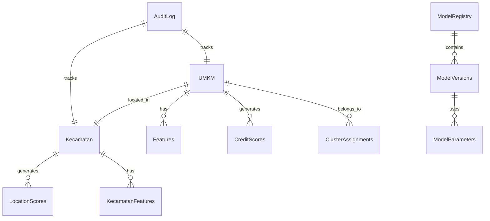

# GeoUMKM Smart - Data Model & Schema

**Version:** 4.0
**Last Updated:** 2026
**Status:** Production Documentation

## Purpose

This document provides comprehensive documentation of the GeoUMKM Smart data model, including entity relationships, database schema, feature engineering, and data lineage. It serves as the reference for data architects, engineers, and analysts working with the system.

---

## Executive Summary

The data model supports three primary entities:
- **UMKM** (Micro, Small, Medium Enterprises): Core business entities
- **Kecamatan** (Sub-districts): Geographic administrative units with aggregated features
- **Model Artifacts**: Trained models and their metadata

The system processes **34 engineered features** across four categories:
- Economic indicators
- Demographic statistics
- Infrastructure accessibility
- Social & community factors

---

## Entity Relationship Diagram



---

## Core Tables

### 1. UMKM (Micro, Small, Medium Enterprise)

**Purpose**: Store core business entity data

```sql
CREATE TABLE umkm (
    umkm_id UUID PRIMARY KEY,
    kecamatan_id INTEGER NOT NULL REFERENCES kecamatan(kecamatan_id),
    
    -- Basic Information
    nama VARCHAR(255) NOT NULL,
    kategori_usaha VARCHAR(100),
    deskripsi_usaha TEXT,
    
    -- Classification
    skala_bisnis VARCHAR(50), -- ENUM: 'mikro', 'kecil', 'menengah'
    sektor_ekonomi VARCHAR(100), -- e.g., 'retail', 'manufaktur', 'jasa'
    
    -- Location
    latitude DECIMAL(10, 8),
    longitude DECIMAL(11, 8),
    alamat TEXT,
    kode_pos VARCHAR(10),
    
    -- Contact
    nama_pemilik VARCHAR(255),
    email VARCHAR(255),
    no_telepon VARCHAR(20),
    
    -- Operational
    tahun_berdiri INTEGER,
    jumlah_karyawan INTEGER,
    pendapatan_tahunan_estimasi DECIMAL(15, 2),
    
    -- Metadata
    data_source VARCHAR(100), -- 'bank_aplikasi', 'government_census', etc.
    last_updated TIMESTAMP DEFAULT CURRENT_TIMESTAMP,
    created_at TIMESTAMP DEFAULT CURRENT_TIMESTAMP,
    is_active BOOLEAN DEFAULT TRUE
);

CREATE INDEX idx_umkm_kecamatan ON umkm(kecamatan_id);
CREATE INDEX idx_umkm_sektor ON umkm(sektor_ekonomi);
CREATE INDEX idx_umkm_skala ON umkm(skala_bisnis);
```

---

### 2. Kecamatan (Sub-district Administrative Unit)

**Purpose**: Store geographic region data and aggregated features

```sql
CREATE TABLE kecamatan (
    kecamatan_id INTEGER PRIMARY KEY,
    kabupaten_id INTEGER,
    provinsi_id INTEGER,
    
    -- Geographic Information
    nama_kecamatan VARCHAR(255) NOT NULL,
    latitude_center DECIMAL(10, 8),
    longitude_center DECIMAL(11, 8),
    luas_area_km2 DECIMAL(10, 2),
    
    -- Administrative
    kode_bps VARCHAR(10), -- BPS code
    
    -- Metadata
    last_updated TIMESTAMP DEFAULT CURRENT_TIMESTAMP,
    created_at TIMESTAMP DEFAULT CURRENT_TIMESTAMP
);

CREATE INDEX idx_kecamatan_kabupaten ON kecamatan(kabupaten_id);
CREATE INDEX idx_kecamatan_provinsi ON kecamatan(provinsi_id);
```

---

### 3. Features (Engineered Features)

**Purpose**: Store 34 engineered features for model input

```sql
CREATE TABLE features (
    feature_id BIGSERIAL PRIMARY KEY,
    umkm_id UUID NOT NULL REFERENCES umkm(umkm_id),
    feature_set_version VARCHAR(10) NOT NULL, -- e.g., 'v1.0', 'v1.1'
    
    -- Economic Features (Features 1-10)
    f001_revenue_growth_rate DECIMAL(10, 4),
    f002_revenue_volatility DECIMAL(10, 4),
    f003_operating_margin DECIMAL(10, 4),
    f004_cash_flow_to_revenue DECIMAL(10, 4),
    f005_inventory_turnover DECIMAL(10, 4),
    f006_receivables_days_outstanding INTEGER,
    f007_debt_to_equity_ratio DECIMAL(10, 4),
    f008_current_ratio DECIMAL(10, 4),
    f009_interest_coverage_ratio DECIMAL(10, 4),
    f010_seasonal_revenue_factor DECIMAL(10, 4),
    
    -- Demographic Features (Features 11-20)
    f011_owner_age INTEGER,
    f012_owner_experience_years INTEGER,
    f013_owner_education_level VARCHAR(50), -- 'SMA', 'S1', 'S2', etc.
    f014_employees_count INTEGER,
    f015_employees_gender_diversity DECIMAL(5, 2),
    f016_staff_turnover_rate DECIMAL(10, 4),
    f017_avg_employee_tenure_months DECIMAL(10, 2),
    f018_business_partners_count INTEGER,
    f019_supplier_diversification_index DECIMAL(10, 4),
    f020_customer_concentration_index DECIMAL(10, 4),
    
    -- Infrastructure Features (Features 21-27)
    f021_distance_to_bank_km DECIMAL(10, 2),
    f022_distance_to_market_km DECIMAL(10, 2),
    f023_road_quality_index DECIMAL(10, 4), -- 0-1 scale
    f024_internet_access_type VARCHAR(50), -- 'fiber', '4g', '3g', 'none'
    f025_electricity_reliability_index DECIMAL(10, 4), -- 0-1 scale
    f026_water_access_index DECIMAL(10, 4), -- 0-1 scale
    f027_warehouse_availability_index DECIMAL(10, 4),
    
    -- Social & Community Features (Features 28-34)
    f028_community_business_concentration INTEGER, -- UMKM density per km2
    f029_formal_registration_indicator INTEGER, -- 1: registered, 0: not
    f030_tax_compliance_indicator INTEGER, -- 1: compliant, 0: not
    f031_digital_payment_adoption DECIMAL(10, 4), -- 0-1 scale
    f032_local_government_support_index DECIMAL(10, 4),
    f033_peer_network_strength INTEGER, -- Number of business associations
    f034_credit_history_score DECIMAL(10, 4), -- 0-1 scale
    
    -- Metadata
    feature_engineering_date TIMESTAMP,
    data_quality_score DECIMAL(5, 2), -- 0-100
    is_complete BOOLEAN DEFAULT TRUE,
    created_at TIMESTAMP DEFAULT CURRENT_TIMESTAMP
);

CREATE INDEX idx_features_umkm ON features(umkm_id);
CREATE INDEX idx_features_version ON features(feature_set_version);
CREATE INDEX idx_features_date ON features(feature_engineering_date);
```

**Feature Categories Breakdown:**

| Category | Features | Count | Description |
|----------|----------|-------|-------------|
| Economic | f001-f010 | 10 | Revenue, profitability, liquidity, leverage |
| Demographic | f011-f020 | 10 | Owner profile, employees, partners, customers |
| Infrastructure | f021-f027 | 7 | Proximity to services, utility access |
| Social & Community | f028-f034 | 7 | Density, compliance, adoption, networks |

---

### 4. Credit Scores

**Purpose**: Store credit risk scores and predictions

```sql
CREATE TABLE credit_scores (
    score_id BIGSERIAL PRIMARY KEY,
    umkm_id UUID NOT NULL REFERENCES umkm(umkm_id),
    
    -- Score Details
    overall_credit_score DECIMAL(5, 2), -- 0-100
    risk_classification VARCHAR(50), -- 'very_low', 'low', 'medium', 'high', 'very_high'
    probability_default DECIMAL(10, 8), -- 0-1
    
    -- Confidence & Distribution
    score_confidence DECIMAL(5, 2), -- 0-100
    
    -- Probability Distribution across buckets
    prob_very_low DECIMAL(10, 8),
    prob_low DECIMAL(10, 8),
    prob_medium DECIMAL(10, 8),
    prob_high DECIMAL(10, 8),
    prob_very_high DECIMAL(10, 8),
    
    -- Model Metadata
    model_version VARCHAR(20), -- e.g., 'xgb_v1.2'
    model_training_date DATE,
    
    -- Audit
    scored_at TIMESTAMP DEFAULT CURRENT_TIMESTAMP,
    valid_until TIMESTAMP, -- Score validity period
    created_by VARCHAR(100),
    created_at TIMESTAMP DEFAULT CURRENT_TIMESTAMP
);

CREATE INDEX idx_credit_scores_umkm ON credit_scores(umkm_id);
CREATE INDEX idx_credit_scores_risk ON credit_scores(risk_classification);
CREATE INDEX idx_credit_scores_valid_until ON credit_scores(valid_until);
```

---

### 5. Location Scores

**Purpose**: Store geographic location opportunity scores

```sql
CREATE TABLE location_scores (
    location_score_id BIGSERIAL PRIMARY KEY,
    kecamatan_id INTEGER NOT NULL REFERENCES kecamatan(kecamatan_id),
    
    -- Score Details
    location_opportunity_score DECIMAL(5, 2), -- 0-100
    economic_vibrancy DECIMAL(5, 2),
    infrastructure_quality DECIMAL(5, 2),
    business_ecosystem_strength DECIMAL(5, 2),
    market_accessibility DECIMAL(5, 2),
    
    -- Ranking
    national_rank INTEGER,
    provincial_rank INTEGER,
    district_rank INTEGER,
    
    -- Model Metadata
    model_version VARCHAR(20),
    model_training_date DATE,
    
    -- Audit
    scored_at TIMESTAMP DEFAULT CURRENT_TIMESTAMP,
    valid_until TIMESTAMP,
    created_at TIMESTAMP DEFAULT CURRENT_TIMESTAMP
);

CREATE INDEX idx_location_scores_kecamatan ON location_scores(kecamatan_id);
CREATE INDEX idx_location_scores_rank_national ON location_scores(national_rank);
```

---

### 6. Cluster Assignments

**Purpose**: Store clustering results (K-Means + DBSCAN hybrid)

```sql
CREATE TABLE cluster_assignments (
    cluster_assignment_id BIGSERIAL PRIMARY KEY,
    umkm_id UUID NOT NULL REFERENCES umkm(umkm_id),
    
    -- Clustering Results
    kmeans_cluster INTEGER, -- Cluster 0-N
    dbscan_cluster INTEGER, -- Cluster 0-N or -1 (noise)
    is_noise_point BOOLEAN, -- DBSCAN noise point indicator
    
    -- Similarity Metrics
    distance_to_cluster_center DECIMAL(10, 6),
    within_cluster_sum_squares DECIMAL(15, 4),
    cluster_cohesion_score DECIMAL(5, 2), -- 0-100
    
    -- Cluster Profile
    cluster_characteristics TEXT, -- JSON: key characteristics
    typical_umkm_profile TEXT,
    
    -- Model Metadata
    model_version VARCHAR(20),
    clustering_date TIMESTAMP,
    
    -- Audit
    created_at TIMESTAMP DEFAULT CURRENT_TIMESTAMP
);

CREATE INDEX idx_cluster_assignments_umkm ON cluster_assignments(umkm_id);
CREATE INDEX idx_cluster_assignments_kmeans ON cluster_assignments(kmeans_cluster);
CREATE INDEX idx_cluster_assignments_dbscan ON cluster_assignments(dbscan_cluster);
```

---

### 7. Recommendations

**Purpose**: Store personalized recommendations for each UMKM

```sql
CREATE TABLE recommendations (
    recommendation_id BIGSERIAL PRIMARY KEY,
    umkm_id UUID NOT NULL REFERENCES umkm(umkm_id),
    
    -- Recommendation Details
    recommendation_type VARCHAR(50), -- 'credit_product', 'policy_program', 'investment'
    recommendation_text TEXT,
    confidence_score DECIMAL(5, 2), -- 0-100
    priority INTEGER, -- 1: highest, 3: lowest
    
    -- Reasoning
    basis_features TEXT, -- JSON array of contributing features
    recommendation_rationale TEXT,
    
    -- Links to Related Programs
    linked_program_id VARCHAR(100),
    linked_program_name VARCHAR(255),
    expected_impact TEXT,
    
    -- Model Metadata
    model_version VARCHAR(20),
    generated_at TIMESTAMP DEFAULT CURRENT_TIMESTAMP,
    valid_until TIMESTAMP,
    
    -- Audit
    created_at TIMESTAMP DEFAULT CURRENT_TIMESTAMP,
    updated_at TIMESTAMP DEFAULT CURRENT_TIMESTAMP
);

CREATE INDEX idx_recommendations_umkm ON recommendations(umkm_id);
CREATE INDEX idx_recommendations_type ON recommendations(recommendation_type);
CREATE INDEX idx_recommendations_priority ON recommendations(priority);
```

---

### 8. Model Registry

**Purpose**: Track model versions, parameters, and metadata

```sql
CREATE TABLE model_registry (
    model_id UUID PRIMARY KEY,
    model_name VARCHAR(100) NOT NULL,
    model_type VARCHAR(50), -- 'location_scoring', 'credit_risk', 'clustering'
    
    -- Versioning
    version_number VARCHAR(20), -- e.g., '1.2.3'
    parent_model_id UUID REFERENCES model_registry(model_id),
    
    -- Model Details
    algorithm VARCHAR(100), -- 'xgboost', 'logistic_regression', 'kmeans'
    training_dataset_size INTEGER,
    num_features INTEGER,
    num_classes_or_clusters INTEGER,
    
    -- Performance Metrics
    training_accuracy DECIMAL(5, 2),
    validation_accuracy DECIMAL(5, 2),
    test_accuracy DECIMAL(5, 2),
    auc_score DECIMAL(5, 4),
    precision DECIMAL(5, 4),
    recall DECIMAL(5, 4),
    f1_score DECIMAL(5, 4),
    
    -- Artifact Locations
    model_artifact_path VARCHAR(500), -- Azure Blob path
    feature_importance_path VARCHAR(500),
    training_log_path VARCHAR(500),
    
    -- Lifecycle
    created_at TIMESTAMP DEFAULT CURRENT_TIMESTAMP,
    trained_at TIMESTAMP,
    deployed_at TIMESTAMP,
    deprecated_at TIMESTAMP,
    status VARCHAR(50), -- 'development', 'validation', 'production', 'deprecated'
    
    -- Metadata
    created_by VARCHAR(100),
    created_reason TEXT
);

CREATE INDEX idx_model_registry_type ON model_registry(model_type);
CREATE INDEX idx_model_registry_status ON model_registry(status);
```

---

### 9. Prediction Cache

**Purpose**: Cache predictions for performance optimization

```sql
CREATE TABLE prediction_cache (
    cache_id BIGSERIAL PRIMARY KEY,
    umkm_id UUID NOT NULL,
    prediction_type VARCHAR(50), -- 'credit', 'location', 'cluster', 'recommendation'
    
    -- Cached Result
    prediction_result JSONB,
    confidence_score DECIMAL(5, 2),
    
    -- Cache Metadata
    cached_at TIMESTAMP DEFAULT CURRENT_TIMESTAMP,
    expires_at TIMESTAMP,
    hit_count INTEGER DEFAULT 0,
    
    -- Source Model
    model_version VARCHAR(20)
);

CREATE INDEX idx_prediction_cache_umkm_type ON prediction_cache(umkm_id, prediction_type);
CREATE INDEX idx_prediction_cache_expires ON prediction_cache(expires_at);
```

---

### 10. Audit Logs

**Purpose**: Track all data access, modifications, and predictions for compliance

```sql
CREATE TABLE audit_logs (
    log_id BIGSERIAL PRIMARY KEY,
    
    -- Entity Being Audited
    entity_type VARCHAR(50), -- 'umkm', 'kecamatan', 'model'
    entity_id VARCHAR(100),
    
    -- Action Details
    action VARCHAR(50), -- 'create', 'read', 'update', 'predict'
    action_details JSONB,
    
    -- User Information
    user_id VARCHAR(100),
    user_role VARCHAR(50), -- 'bank', 'government', 'investor'
    user_email VARCHAR(255),
    
    -- Compliance
    reason_code VARCHAR(50), -- OJK compliance code
    compliance_check_status VARCHAR(50),
    
    -- Metadata
    timestamp TIMESTAMP DEFAULT CURRENT_TIMESTAMP,
    ip_address INET,
    user_agent TEXT,
    request_id UUID
);

CREATE INDEX idx_audit_logs_entity ON audit_logs(entity_type, entity_id);
CREATE INDEX idx_audit_logs_timestamp ON audit_logs(timestamp);
CREATE INDEX idx_audit_logs_user ON audit_logs(user_id);
```

---

## Data Dictionary

### Feature Engineering Specifications

| Feature | Type | Range | Description | Data Source |
|---------|------|-------|-------------|-------------|
| f001_revenue_growth_rate | Decimal | -1.0 to 10.0 | YoY revenue growth rate | Financial data |
| f002_revenue_volatility | Decimal | 0 to 1 | Standard deviation of monthly revenue | Financial data |
| f003_operating_margin | Decimal | -1.0 to 1.0 | Operating income / revenue | Financial data |
| f004_cash_flow_to_revenue | Decimal | -1.0 to 1.0 | Operating cash flow / revenue | Financial data |
| f005_inventory_turnover | Decimal | 0 to 100 | COGS / average inventory | Financial data |
| f006_receivables_days_outstanding | Integer | 0 to 365 | Days to collect receivables | Financial data |
| f007_debt_to_equity_ratio | Decimal | 0 to 10 | Total debt / total equity | Financial data |
| f008_current_ratio | Decimal | 0 to 5 | Current assets / current liabilities | Financial data |
| f009_interest_coverage_ratio | Decimal | 0 to 100 | EBIT / interest expense | Financial data |
| f010_seasonal_revenue_factor | Decimal | 0 to 1 | Max seasonal adjustment factor | Financial data |
| f011_owner_age | Integer | 18 to 100 | Age in years | Owner demographics |
| f012_owner_experience_years | Integer | 0 to 80 | Years in business | Owner history |
| f013_owner_education_level | String | SD/SMP/SMA/S1/S2 | Highest education | Owner profile |
| f014_employees_count | Integer | 0 to 5000 | Number of employees | HR data |
| f015_employees_gender_diversity | Decimal | 0 to 100 | Female % of workforce | HR data |
| f016_staff_turnover_rate | Decimal | 0 to 1 | Annual turnover rate | HR data |
| f017_avg_employee_tenure_months | Decimal | 0 to 600 | Average tenure in months | HR data |
| f018_business_partners_count | Integer | 0 to 1000 | Number of business partners | Network data |
| f019_supplier_diversification_index | Decimal | 0 to 1 | Herfindahl index of suppliers | Supply chain |
| f020_customer_concentration_index | Decimal | 0 to 1 | Share of top customer | Customer data |
| f021_distance_to_bank_km | Decimal | 0 to 100 | Distance to nearest bank | Geospatial |
| f022_distance_to_market_km | Decimal | 0 to 100 | Distance to nearest market | Geospatial |
| f023_road_quality_index | Decimal | 0 to 1 | Normalized road quality score | Infrastructure |
| f024_internet_access_type | String | fiber/4g/3g/none | Primary internet access type | Infrastructure |
| f025_electricity_reliability_index | Decimal | 0 to 1 | Uptime / reliability score | Utilities |
| f026_water_access_index | Decimal | 0 to 1 | Access quality & reliability | Utilities |
| f027_warehouse_availability_index | Decimal | 0 to 1 | Storage facility availability | Infrastructure |
| f028_community_business_concentration | Integer | 0 to 10000 | UMKM density per km² | Regional |
| f029_formal_registration_indicator | Integer | 0/1 | Business registration status | Admin |
| f030_tax_compliance_indicator | Integer | 0/1 | Tax filing compliance | Admin |
| f031_digital_payment_adoption | Decimal | 0 to 1 | Digital payment transaction % | Behavior |
| f032_local_government_support_index | Decimal | 0 to 1 | Support program access score | Policy |
| f033_peer_network_strength | Integer | 0 to 100 | Active business associations | Network |
| f034_credit_history_score | Decimal | 0 to 1 | Credit performance normalized | Credit bureau |

---

## Data Lineage

```mermaid
graph LR
    RAW["Raw Data Sources"]
    
    RAW -->|Import| IMPORT["01: Data Import"]
    IMPORT -->|Clean| CLEAN["02: EDA & Cleaning"]
    CLEAN -->|Engineer| FEATURES["Features Table"]
    
    FEATURES -->|Select| SELECTED["Selected Features"]
    
    SELECTED -->|Train| MODEL["ML Models"]
    MODEL -->|Predict| SCORES["Credit/Location Scores"]
    
    SCORES -->|Store| DB["PostgreSQL Database"]
    DB -->|Cache| CACHE["Redis Cache"]
    CACHE -->|Serve| API["REST API"]
    API -->|Display| DASH["React Dashboard"]
```



---

## Data Quality Standards

### Completeness
- Critical fields: ≥99% non-null
- Feature fields: ≥95% non-null
- Audit fields: 100% required

### Accuracy
- Financial data: Verified against source systems
- Geospatial data: Validated against official registries
- Classification data: Consistent with OJK/BI standards

### Timeliness
- UMKM master data: Updated monthly
- Features: Recalculated quarterly
- Scores: Refreshed annually or on-request

### Consistency
- No duplicate UMKM records (controlled via unique constraint)
- All foreign key relationships maintained
- Categorical values from defined enumeration

---

## Data Retention Policy

| Data Type | Retention Period | Rationale |
|-----------|------------------|-----------|
| UMKM Master Data | 10 years | OJK compliance |
| Financial Data | 7 years | Tax requirements |
| Prediction Scores | 3 years | Model versioning |
| Audit Logs | 5 years | Compliance & forensics |
| Cache Data | 24 hours | Performance optimization |
| Model Artifacts | Indefinite | Model reproducibility |

---

## Privacy & Security

### Data Classification
- **Public**: Geographic aggregates, published reports
- **Confidential**: Individual UMKM data (access restricted)
- **Restricted**: Owner PII, financial details (encrypted)
- **Secret**: Encryption keys, model parameters (highly protected)

### Masking Rules
- Email: Show first 2 chars + asterisks
- Phone: Show last 4 digits
- Revenue: Rounded to nearest 10M
- Coordinates: Rounded to 3 decimal places

---

## Changelog

| Version | Date | Changes |
|---------|------|---------|
| 1.0 | 2026 | Initial comprehensive data model documentation |
